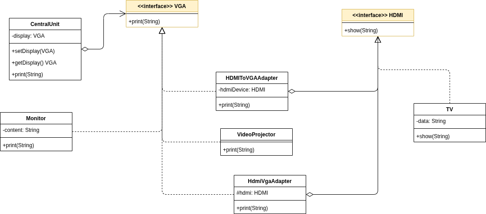
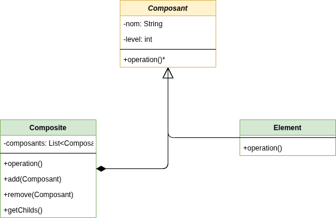
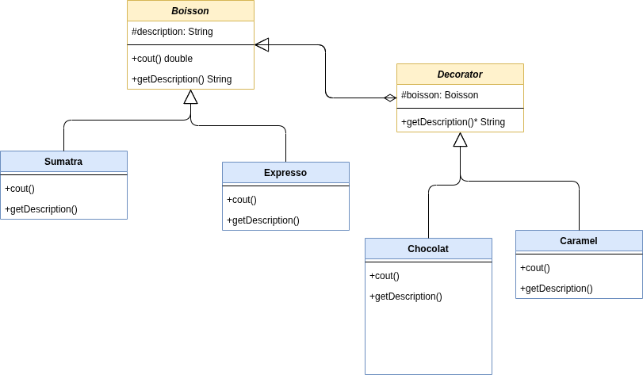
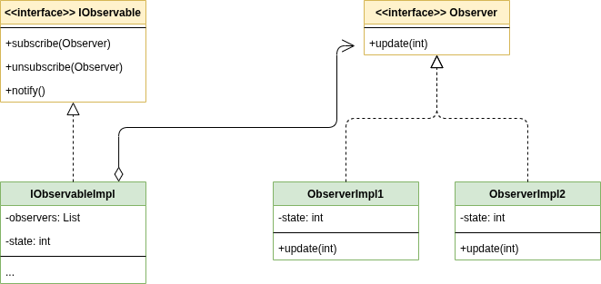
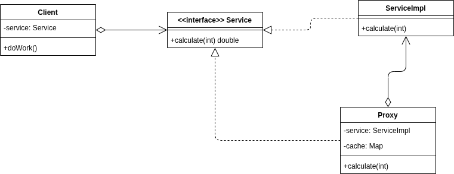
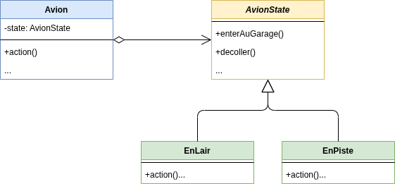
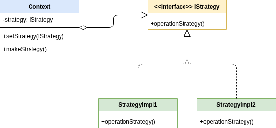
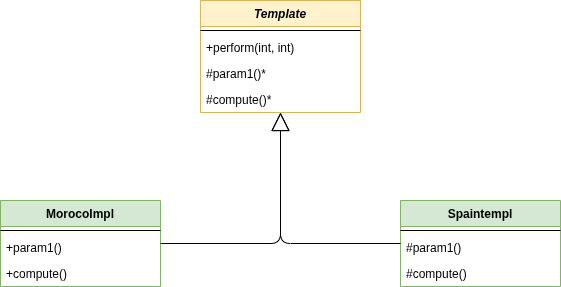

# Design Patterns UML Class Diagrams

## Adapter Pattern

Allows incompatible interfaces to work together. It wraps an existing class with a new interface.

## Composite Pattern

Composes objects into tree structures to represent part-whole hierarchies. It allows clients to treat individual objects and compositions of objects uniformly.

## Decorator Pattern

Attaches additional responsibilities to an object dynamically. It provides a flexible alternative to subclassing for extending functionality.

## Observer Pattern

Defines a one-to-many dependency between objects so that when one object changes state, all its dependents are notified and updated automatically.

## Proxy Pattern

Provides a surrogate or placeholder for another object to control access to it.

## State Pattern

Allows an object to alter its behavior when its internal state changes. The object will appear to change its class.

## Strategy Pattern

Defines a family of algorithms, encapsulates each one, and makes them interchangeable. It allows the algorithm to vary independently from clients that use it.

## Template Pattern

Defines the skeleton of an algorithm in an operation, deferring some steps to subclasses. It allows subclasses to redefine certain steps of an algorithm without changing the algorithm's structure.

